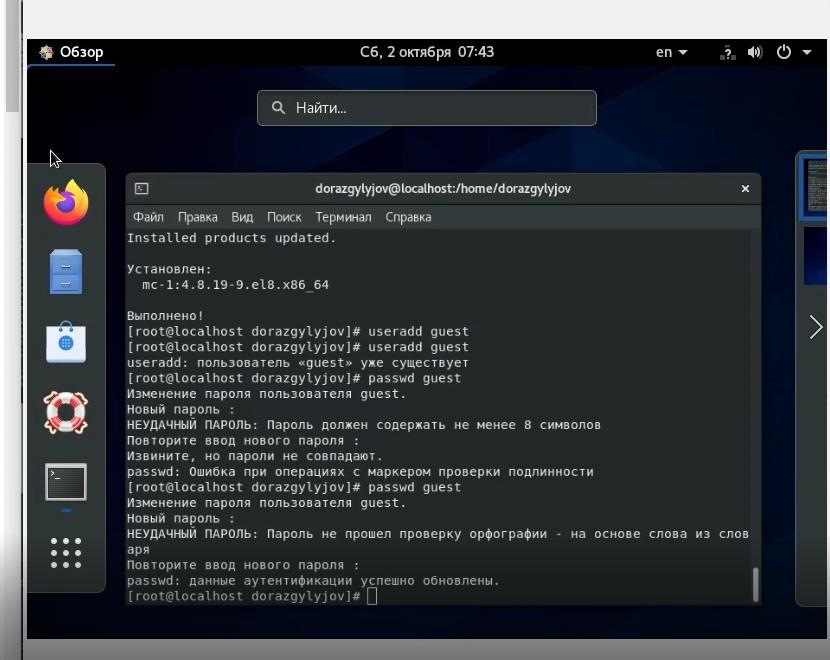
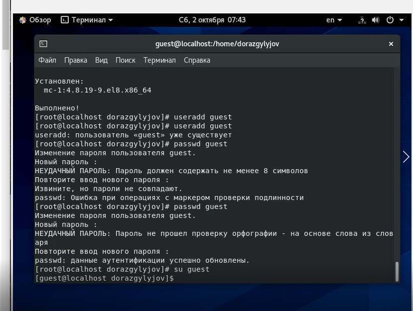
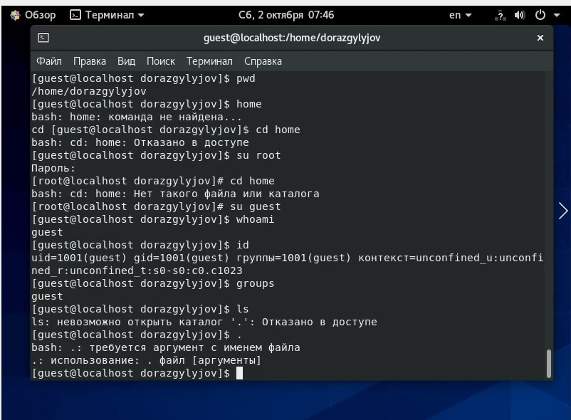
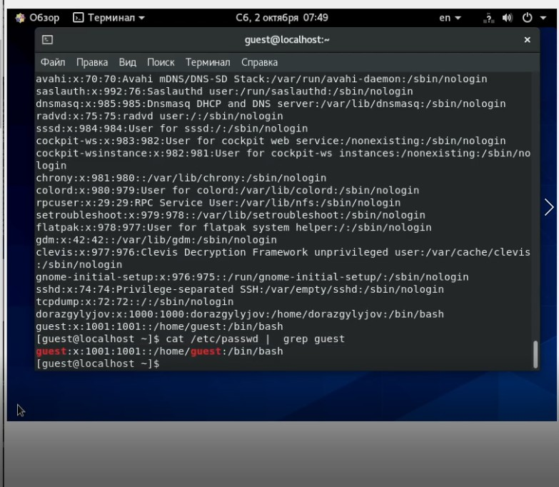
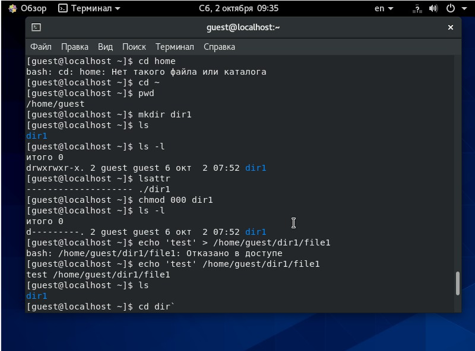
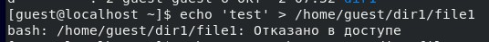

---
# Front matter
lang: ru-RU
title: "Отчёт по лабораторной работе №2"
subtitle: "Дискреционное разграничение прав в CentOS"
author: "Оразклычев Довлет НФИбд-02-18"

# Formatting
toc-title: "Содержание"
toc: true # Table of contents
toc_depth: 2
lof: true # List of figures
fontsize: 12pt
linestretch: 1.5
papersize: a4paper
documentclass: scrreprt
polyglossia-lang: russian
polyglossia-otherlangs: english
mainfont: Arial
romanfont: Arial
sansfont: Arial
monofont: Arial
mainfontoptions: Ligatures=TeX
romanfontoptions: Ligatures=TeX
sansfontoptions: Ligatures=TeX,Scale=MatchLowercase
monofontoptions: Scale=MatchLowercase
indent: true
pdf-engine: lualatex
header-includes:
  - \linepenalty=10 # the penalty added to the badness of each line within a paragraph (no associated penalty node) Increasing the value makes tex try to have fewer lines in the paragraph.
  - \interlinepenalty=0 # value of the penalty (node) added after each line of a paragraph.
  - \hyphenpenalty=50 # the penalty for line breaking at an automatically inserted hyphen
  - \exhyphenpenalty=50 # the penalty for line breaking at an explicit hyphen
  - \binoppenalty=700 # the penalty for breaking a line at a binary operator
  - \relpenalty=500 # the penalty for breaking a line at a relation
  - \clubpenalty=150 # extra penalty for breaking after first line of a paragraph
  - \widowpenalty=150 # extra penalty for breaking before last line of a paragraph
  - \displaywidowpenalty=50 # extra penalty for breaking before last line before a display math
  - \brokenpenalty=100 # extra penalty for page breaking after a hyphenated line
  - \predisplaypenalty=10000 # penalty for breaking before a display
  - \postdisplaypenalty=0 # penalty for breaking after a display
  - \floatingpenalty = 20000 # penalty for splitting an insertion (can only be split footnote in standard LaTeX)
  - \raggedbottom # or \flushbottom
  - \usepackage{float} # keep figures where there are in the text
  - \floatplacement{figure}{H} # keep figures where there are in the text
---

# Цель работы

Получение практических навыков работы в консоли с атрибутами файлов, закрепление теоретических основ дискреционного разграничения доступа в современных системах с открытым кодом на базе CentOS

# Выполнение лабораторной работы

1.	Создали учётную запись пользователя guest (используя учётную запись администратора) и задали ему пароль:

{ #fig:001 width=70% }

2.	Вошли в систему от имени пользователя guest

{ #fig:002 width=70% }

3.	Командой pwd определили директорию, в которой находимся

4.	Уточнили имя нашего пользователя командой whoami

5.	Уточнили имя пользователя, его группу, а также группы, куда входит пользователь, командой id. Сравнили вывод id с выводом команды groups - id выдает всю информацию gid, id, группы т.д., а groups выводит только имя группы - guest. gid = 1001(guest)

{ #fig:003 width=70% }

6. Сравним полученную информацию об имени пользователя с данными, выводимыми в приглашении командной строки и убедимся, что они совпадают

7.	Просмотрим файл /etc/passwd Командой: cat /etc/passwd. Найдем в нём свою учётную запись. Определим uid пользователя. Определим gid пользователя. Сравним найденные значения с полученными в предыдущих пунктах.

{ #fig:004 width=70% }

8.	Определим существующие в системе директории командой ls -l /home/
 
9.	Проверили, какие расширенные атрибуты установлены на поддиректориях, находящихся в директории /home, командой: lsattr /home. Нам не удалось увидеть расширенные атрибуты директорий других пользователей, только своей домашней директории.

10.	Создали в домашней директории поддиректорию dir1 командой mkdir dir1. Определим командами ls -l и lsattr, какие права доступа и расширенные атрибуты были выставлены на директорию dir1.

11.	Сняли с директории dir1 все атрибуты командой chmod 000 dir1 и проверили с помощью ls -l  правильность выполнения команды chmod.

{ #fig:005 width=70% }

12.	Попытались создать в директирии dir1 файл file1 командой echo "test" > /home/guest/dir1/file1. Однако получили отказ из-за недостатка прав

{ #fig:006 width=70% }

13. Заполним таблицу «Установленные права и разрешённые действия». Выполняем от лица пользователя guest (т.е. от создателя директории). Нужно проверить все 64 варианта аттрибутов на различные права в директориях и файлах

:Права для всех 64 вариантов аттрибутов

|Права директории|Права файла|Создание файла|Удаление файла|Запись в файл|Чтение файла|Смена директории|Просмотр файлов в директории|Переименование файла|Смена атрибутов файла|
|:---|:---|---|---|---|---|---|---|---|---|
|```000```|```000```|-|-|-|-|-|-|-|-|
|```100```|```000```|-|-|-|-|+|-|-|+|
|```200```|```000```|-|-|-|-|-|-|-|-|
|```300```|```000```|+|+|-|-|+|-|+|+|
|```400```|```000```|-|-|-|-|-|-|-|-|
|```500```|```000```|-|-|-|-|+|+|-|+|
|```600```|```000```|-|-|-|-|-|-|-|-|
|```700```|```000```|+|+|-|-|+|+|+|+|
|```000```|```100```|-|-|-|-|-|-|-|-|
|```100```|```100```|-|-|-|-|+|-|-|+|
|```200```|```100```|-|-|-|-|-|-|-|-|
|```300```|```100```|+|+|-|-|+|-|+|+|
|```400```|```100```|-|-|-|-|-|-|-|-|
|```500```|```100```|-|-|-|-|+|+|-|+|
|```600```|```100```|-|-|-|-|-|-|-|-|
|```700```|```100```|+|+|-|-|+|+|+|+|
|```000```|```200```|-|-|-|-|-|-|-|-|
|```100```|```200```|-|-|+|-|+|-|-|+|
|```200```|```200```|-|-|-|-|-|-|-|-|
|```300```|```200```|+|+|+|-|+|-|+|+|
|```400```|```200```|-|-|-|-|-|-|-|-|
|```500```|```200```|-|-|+|-|+|+|-|+|
|```600```|```200```|-|-|-|-|-|-|-|-|
|```700```|```200```|+|+|+|-|+|+|+|+|
|```000```|```300```|-|-|-|-|-|-|-|-|
|```100```|```300```|-|-|+|-|+|-|-|+|
|```200```|```300```|-|-|-|-|-|-|-|-|
|```300```|```300```|+|+|+|-|+|-|+|+|
|```400```|```300```|-|-|-|-|-|-|-|-|
|```500```|```300```|-|-|+|-|+|+|-|+|
|```600```|```300```|-|-|-|-|-|-|-|-|
|```700```|```300```|+|+|+|-|+|+|+|+|
|```000```|```400```|-|-|-|-|-|-|-|-|
|```100```|```400```|-|-|-|+|+|-|-|+|
|```200```|```400```|-|-|-|-|-|-|-|-|
|```300```|```400```|+|+|-|+|+|-|+|+|
|```400```|```400```|-|-|-|-|-|-|-|-|
|```500```|```400```|-|-|-|+|+|+|-|+|
|```600```|```400```|-|-|-|-|-|-|-|-|
|```700```|```400```|+|+|-|+|+|+|+|+|
|```000```|```500```|-|-|-|-|-|-|-|-|
|```100```|```500```|-|-|-|+|+|-|-|+|
|```200```|```500```|-|-|-|-|-|-|-|-|
|```300```|```500```|+|+|-|+|+|-|+|+|
|```400```|```500```|-|-|-|-|-|-|-|-|
|```500```|```500```|-|-|-|+|+|+|-|+|
|```600```|```500```|-|-|-|-|-|-|-|-|
|```700```|```500```|+|+|-|+|+|+|+|+|
|```000```|```600```|-|-|-|-|-|-|-|-|
|```100```|```600```|-|-|+|+|+|-|-|+|
|```200```|```600```|-|-|-|-|-|-|-|-|
|```300```|```600```|+|+|+|+|+|-|+|+|
|```400```|```600```|-|-|-|-|-|-|-|-|
|```500```|```600```|-|-|+|+|+|+|-|+|
|```600```|```600```|-|-|-|-|-|-|-|-|
|```700```|```600```|+|+|+|+|+|+|+|+|
|```000```|```700```|-|-|-|-|-|-|-|-|
|```100```|```700```|-|-|+|+|+|-|-|+|
|```200```|```700```|-|-|-|-|-|-|-|-|
|```300```|```700```|+|+|+|+|+|-|+|+|
|```400```|```700```|-|-|-|-|-|-|-|-|
|```500```|```700```|-|-|+|+|+|+|-|+|
|```600```|```700```|-|-|-|-|-|-|-|-|
|```700```|```700```|+|+|+|+|+|+|+|+|

Для заполнения последних двух строк опытным путем проверили минимальные права. 

: Список минимальных прав для указанных операций

|Операция|Права на директорию|Права на файл|
|:---:|:---:|:---:|
|Создание файла|```300```|```000```|	    
|Удаление файла|```300```|```000```|
|Чтение файла|```100```|```400```|
|Запись в файл|```100```|```200```|
|Переименование файла|```300```|```000```|
|Создание поддиректории|```300```|```000```|
|Удаление поддиректории|```300```|```000```|

# Вывод

Получили практические навыки работы в консоли с атрибутами файлов, закрепление теоретических основ дискреционного разграничения доступа в современных системах с открытым кодом на базе CentOS