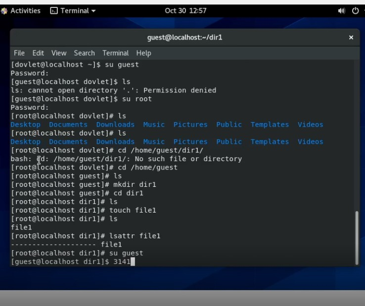
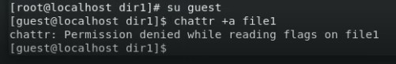
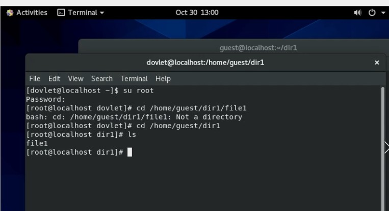
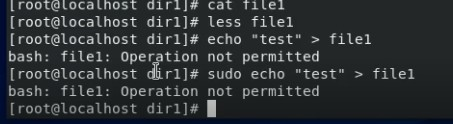
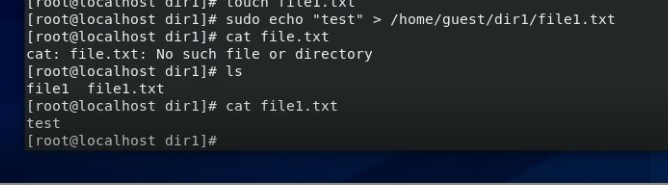
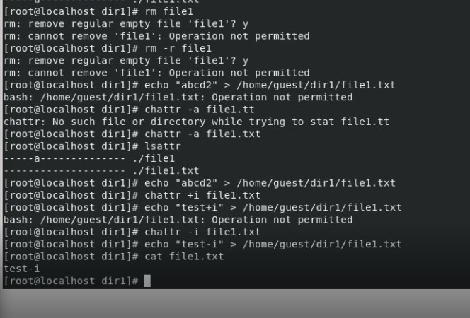

---
# Front matter
lang: ru-RU
title: "Отчёт по лабораторной работе №4"
subtitle: "Дискреционное разграничение прав в Linux. Расширенные атрибуты"
author: "Оразклычев Довлет НФИбд-02-18"

# Formatting
toc-title: "Содержание"
toc: true # Table of contents
toc_depth: 2
lof: true # List of figures
fontsize: 12pt
linestretch: 1.5
papersize: a4paper
documentclass: scrreprt
polyglossia-lang: russian
polyglossia-otherlangs: english
mainfont: Arial
romanfont: Arial
sansfont: Arial
monofont: Arial
mainfontoptions: Ligatures=TeX
romanfontoptions: Ligatures=TeX
sansfontoptions: Ligatures=TeX,Scale=MatchLowercase
monofontoptions: Scale=MatchLowercase
indent: true
pdf-engine: lualatex
header-includes:
  - \linepenalty=10 # the penalty added to the badness of each line within a paragraph (no associated penalty node) Increasing the value makes tex try to have fewer lines in the paragraph.
  - \interlinepenalty=0 # value of the penalty (node) added after each line of a paragraph.
  - \hyphenpenalty=50 # the penalty for line breaking at an automatically inserted hyphen
  - \exhyphenpenalty=50 # the penalty for line breaking at an explicit hyphen
  - \binoppenalty=700 # the penalty for breaking a line at a binary operator
  - \relpenalty=500 # the penalty for breaking a line at a relation
  - \clubpenalty=150 # extra penalty for breaking after first line of a paragraph
  - \widowpenalty=150 # extra penalty for breaking before last line of a paragraph
  - \displaywidowpenalty=50 # extra penalty for breaking before last line before a display math
  - \brokenpenalty=100 # extra penalty for page breaking after a hyphenated line
  - \predisplaypenalty=10000 # penalty for breaking before a display
  - \postdisplaypenalty=0 # penalty for breaking after a display
  - \floatingpenalty = 20000 # penalty for splitting an insertion (can only be split footnote in standard LaTeX)
  - \raggedbottom # or \flushbottom
  - \usepackage{float} # keep figures where there are in the text
  - \floatplacement{figure}{H} # keep figures where there are in the text
---

# Цель работы

Получение практических навыков работы в консоли с расширенными
атрибутами файлов

# Выполнение лабораторной работы

1.	От имени пользователя guest определили расширенные атрибуты файла

{ #fig:001 width=70% }

2.	Установили командой **chmod 600 file1** на файл **file1** права, разрешающие чтение и запись для владельца файла

3.	Попробовали установить на файл /home/guest/dir1/file1 расширенный атрибут a от имени пользователя guest:

{ #fig:002 width=70% }

4.	Повысили свои права с помощью команды su. Попробовали установить расширенный атрибут **a** на файл **/home/guest/dir1/file1** от имени суперпользователя:
{ #fig:002 width=70% }

5.	От пользователя guest проверили правильность установления атрибута:

6. Выполнили дозапись в файл file1 слова «test» командой и после прочли его

{ #fig:002 width=70% }

7.	Попробовали удалить файл file1 либо стереть имеющуюся в нём информацию командой. Ничего не вышло

8.	Убрали ему ограничения и сняли флажок. После этого с файлом доступны стали все манипуляции.

{ #fig:002 width=70% }
 
9.	Повторили все действия по шагам, заменив атрибут «a» атрибутом «i». Все действия также обвенчались неудачей

{ #fig:002 width=70% }

# Вывод

Получили практические навыки работы в консоли с расширенными
атрибутами файлов
